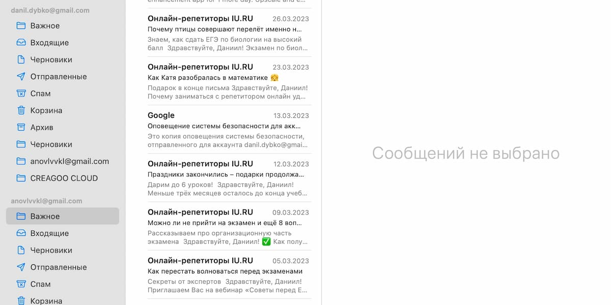

# Общение с клиентами в интернете

Действительно важно для успешных продаж.

Открытая почта

Почти каждый из нас понимает, что общение с клиентами — это первое составляющее продаж. Ведь человек хочет получить
товар, а мы хотим его продать. И нам следует ответить на вопросы или предложения покупателя. Но каждое предложение
покупателя стоит рассматривать?

### Начало общения

Для начала, вам не следует нервничать и задавать кучу вопросов покупателю. Это может являться причиной отказа вам в
покупке товара. Если ваша задача продать товар — вы должны быть уверенными в его актуальности и причины покупки. А
значит и нервоз вам ни к чему.

### Дополнительная информация

Если клиент попросил дополнительную информацию — смело давайте ему ответ. Не следует отвечать «Фото в профиле» или
«Посмотрите в интернете». Ведь если человек хотел бы узнать информацию в интернете, то открыл бы браузер, а тут он
написал именно вам. Многие понимают важность дополнительных вопросов, но не понимают значимость ответов на них.

Из опыта я рекомендую собрать некоторую дополнительную информацию заранее и загрузить ее на облако. А к облаку давать
доступ по запросу или оставить ссылку в описании. Люди могут обращаться к вам только в последнюю очередь. И ссылка в
описании точно не будет лишней, но если ссылка будет кликабельной.

### «А обмен интересует?»

Пускай вы в описании напишите о том, что обмена нет, вам все равно будут писать люди с такими предложениями. Просто
вежливо отказывайте им: «Здравствуйте, к сожалению, но обмена для данного товара нет. Большое спасибо».

И если у вас есть товар, который вы хотели бы обменять — попробуйте его предложить в качестве альтернативы. Если
покупатель захочет — он обратится к вам с предложением.

### Клиент как рыбка: может уйти

Помните, что клиент всегда может уйти. Может у него есть другое предложение, более интересное чем ваше. Возможно клиент
просто больше не может вести беседу. Все может быть.

Не стоит паниковать из-за этого и считать минуты, как долго вам не пишут. Но клиентов же нужно запоминать, предлагать им
что-то? Да, и сейчас мы об этом поговорим.

### Помните клиентов, они это любят

Покупатели очень любят, когда о них заботятся — для успешных продаж это в обязательном порядке должно быть слоганом
ваших продаж. И ведь правда, всегда приятно, когда к вам обращаются исходя ваших интересов: может красный цвет? Размером
чуть побольше?

Не забывайте клиентов: записывайте их в отдельную таблицу. Конечно, каждого не запомнишь. Но даже парочку клиентов могут
составить хороший чек или пригласить доброжелательных покупателей-знакомых.

### Наглость клиента

Если к вам обращаются неуважительно — вы можете попросить изменить отношение к вам. В конечном счете, если клиент
откажется, вам придется его заблокировать. И ничего страшного в этом нет. Не нужно блокировать каждого неугодного. Но и
терпеть к себе плохое отношение — тоже плохой вариант.

Помните: не бывает плохих людей. Вы же не знаете, что случилось у человека. Не отвечайте ему злом на зло. Если не
получается вести адекватную беседу — попросите покинуть диалог в таком состоянии, пригрозив блокировкой.

Если у вас есть возможность и желание — вы можете внести человека в черных список, навечно отказав ему в покупках. Но я
считаю, что это следует делать в случае со сталкерством: когда от вас чего-то требуют с разных аккаунтов.

В любом из случаев, хоть несколько раз в месяц, но вам придется терпеть не самых приятных людей в общении. Помните это.

### Предлагайте

Не бойтесь предложить чего-то. Напишите покупателю, что именно эту модель выбирают чаще всего. Или же сообщите об
обновлениях: клиента точно это должно порадовать, и он может назначить встречу.

В любом из случаев, человек может не знать, с каким предложением ему следует обратиться к вам. Помогите клиенту. Будьте
для него будто бы друг, который не обманет и предложит самое лучшее.

### Скидки

Не стоит сразу же отказывать в скидках. Это было моей ошибкой, когда на скидку я сразу же отвечал отказом, ведь с
клиентом нужно уметь вести общение. Скидка для вас обоих как крючок — для вас интерес поднять его, а для клиента
опустить. Сыграйте на этом — вы можете указать, что не можете опустить цену ниже из-за определенных причин. Но если
клиент возьмет дополнительный товар — скидка может быть предоставлена.

Конечно, скидка для продавца это не самый приятный процесс. Но если сравнивать цифры, то 2 продажи в 15000 будут куда
приятнее, чем их отсутствие. Используйте скидку как инструмент в своих руках.

### Назначение встречи

Первое, что порекомендую — указывать место сделки исходя из 2 фактов: недалеко от дома, но не возле дома.

Зачем назначать сделку недалеко от дома? Все для того, чтобы вам не было обидно, если сделка не состоится. У вас интерес
продать технику. А покупатель должен приехать к вам и осмотреть товар. Будет действительно плохо, если дома вы
что-нибудь забудете.

На своем месте я могу пойти на встречу, но не ехать куда-нибудь, чтобы назначить встречу. Будут и другие клиенты,
которые будут готовы приехать на встречу в указанное время.

А не возле дома, банально, для безопасности. После вопроса «А вы где живете?» в случае проблем с товаром вы можете
ожидать к себе гостей.

И пускай это может быть только в «мечтах», я бы все равно не стал рисковать и назначать встречи у дома. Максимум — это
из-за большой техники, не называя точный адрес. Ведь рядом с вами может быть несколько зданий, и какие именно из них ваш
дом — неизвестно.

### Доставка

Доставка — это весьма опасно, если вы пользуетесь сервисами по типу Авито доставки. Потому что проблема данного типа
доставки в том, что вас могут обмануть. Если пользоваться обычной доставкой — то тут нет проблем: 100% предоплата, в
случае чего человек может вернуть товар, оплачивая посылку.

Но что же именно не так с Авито доставкой? На момент ее запуска хотелось решить проблему, что продавцы кладут не тот
товар, который продают: отличаются или характеристики или сам товар. Но теперь из-за попытки решения данной проблемы
страдают уже сами продавцы.

Как работает Авито доставка: покупатель оплатил товар, перечисленные средства находятся у Авито. Продавцу нужно прийти в
отдел почты, оформить посылку и отправить ее на указанный адрес. И уже здесь прослеживается первый тип обмана: человек
просит отправить на отличный адрес, из-за чего посылка не приходит на адрес, который указан в системе, оформляет возврат
средств, имеет товар и средства.

Но если с адресом нет проблем, то посылка доходит до покупателя. Ему требуется распаковать ее, проверить и указать, все
ли верно. Если все верно — деньги перечисляются продавцу, а если имеется какая-то проблема — оформляется возврат, товар
отправляется назад продавцу, деньги остаются у покупателя.

И проблема в том, что покупатель может открыть посылку, забрать товар, положить другой. И уже ничего и никому не
докажешь. Вроде бы Авито обещает покрывать расходы. Но достаточно вбить 3 слова: «Авито доставка обман» и понять, как
обстоят дела на самом деле.

Пользоваться ли Авито доставкой или нет — выбор за вами. Я лишь озвучил мнение.

Желаю вам удачи в общении с клиентами.
