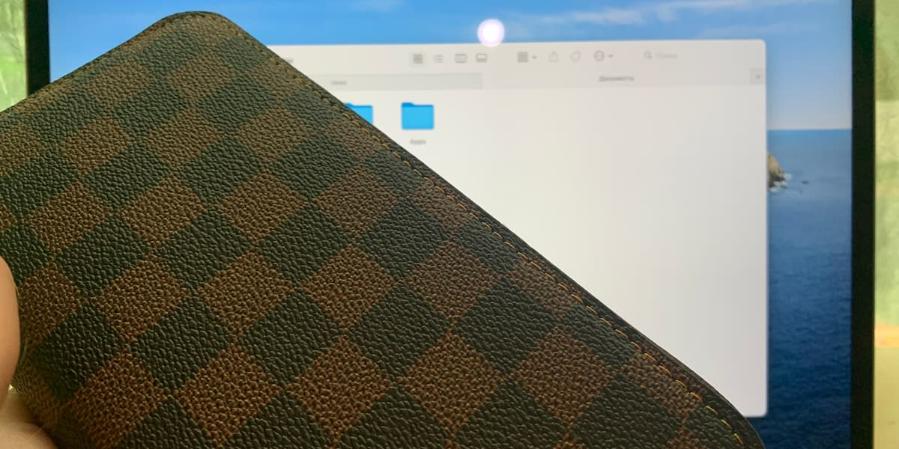

# Как успешно продавать на Б/У рынках

Разберем все по полочкам с примерами из жизни.

Портмоне на фоне ноутбука.

У вас есть старый девайс, который просто лежит и пылится. А вы хотите получить за него средства? Просто отдать его в
магазин — плохой вариант. Скупки тоже не очень, вы получите слишком мало за товар. Поэтому в силу вступают Б/У рынки, на
которых вы можете самостоятельно продавать. Разберем стратегию продаж на популярных интернет-площадок.

### Не продавайте товар скупкам

С начала может показаться, что скупки — это отличный вариант, чтобы быстро продать какой-то товар. Но не стоит спешить с
этим вопросом.

Скупки — это очень плохой вариант, чтобы продать технику. Потому что вам заплатят максимум 70% от реальной стоимости
товара, это еще в лучшем случае. Обычно платят от 15% до 45%.

К тому же, в скупках работают люди, которые разбираются в технике. И, вероятно, они захотят еще сильнее снизить цену
покупки вашего товара. Потому что скупки работают именно на этом: разница между продажей и покупкой и есть прибыль.

### Выбирайте несколько площадок

Будьте готовы, что вам нужно будет выставлять объявление через несколько площадок. Пусть среди них будет только 1
крупная, все равно не стоит упускать это из внимания.

Конечно, не стоит доходить до того, чтобы расклеивать объявления по улицам, но не стесняйтесь предлагать купить ваш
товар, например, знакомым.

### Правила продаж

Перед тем, как продавать — почитайте правила размещения товара именно на данной площадкой. Вам обязательно нужно быть
знакомым с этим, чтобы вас не заблокировали.

Если вы нарушите правила определенной площадки — вас могут заблокировать без возможности разблокировки. Это очень плохо,
если вы указывали до этого свои паспортные данные. Из-за блокировки вы будете терять трафик на ваш товар.

### Представляем товар

Теперь нам нужно представить сам товар. Давайте пройдемся по 4 пунктам более подробно: название, описание, фотографии,
видео.

**Название**: оно должно содержать ключевые слова товара. Название: «Продаю телефон дешево айфон iPhone» плохое,
потому что
не отражает суть товара. Лучше написать: «iPhone 6s розовый 128 комплект» — меньше слов, больше дела. Из названия сразу
понятно, что за товар. Также понятны его основные характеристики.

Товар среди всего большинства будут искать именно по ключевым словам. Поэтому старайтесь не использовать бессмысленные
слова, по типу «Продаю телефон» или «Хорошая модель». Говорите конкретно.

**Описание товара**: напишите максимум уникальной информации именно для вашего товара. Укажите все его
характеристики:
название модели, цвет, объем памяти. Также не будет лишним указать статистику, скорость работы. Проведите для модели
некоторые сравнения, тесты. Укажите это в описании. Не стоит указывать в описании: контактные данные, ссылки, другие
объявления, цену, место встречи.

Все, что нужно для связи и информирования будет заполнено в других графах. К ним мы еще перейдем.

**Фотографии**: вместе с названием, это самая важная часть объявления. Если у вас нет хорошей камеры — позовите
друзей, не
стесняйтесь. Не бойтесь выйти на улицу с товаром.

Делайте красивые фотографии. С первой фотографии покажите работу устройства. Делайте такие фотографии, чтобы можно было
рассмотреть товар. Также не бойтесь использовать стиль. Делайте фотографии во время использования товара. Покажите
покупателю, как товар будет виден для окружающих.

Если у вас есть 2 одинаковых товара — не поленитесь сделать уникальные фотографии для каждого из них. Первая фотография
объявления должна показывать, что за товар вы продаете. Из всего списка фотографий вы можете 1-2 уделить на информацию,
можете использовать графические редакторы, чтобы разместить на фотографиях текст.

Не стоит заполнять фотографии лишними данными: пользователи на фотографиях хотят увидеть товар. Все остальное они поймут
сами. Достаточно дополнительно в описании указать некоторые приятные характеристики: «хорошие тактильные впечатления»,
«быстрая работа» и прочее.

**Видео**: почему-то многие продавцы ленятся снимать видео-обзор их товаров на продажу. Это является большой ошибкой.
Потому
что человек при покупке товара будет рассматривать его по фотографиям. наличие видео — большой плюс к покупке.

Не поленитесь снять видео о вашем товаре. В видео по максимуму показывайте товар. Если на фоне у вас есть голос —
добавьте субтитры, которые будут видны пользователю. В описании к видео укажите ссылку на объявление. Название укажите
такое же, которое писали до этого.

### Остальная информация для покупателей

Также в объявлении вам следует указать следующую информацию: характеристики в отдельное поле, модель устройства, цену,
место встречи, связь с вами.

Характеристики и название модели — просто указывайте ваши данные устройства. Это полезно указывать, чтобы у
пользователей была возможность использовать фильтры.

Цена — указывайте ту цену, которая вас интересует, добавив к ней 5-7%. Проценты требуется добавлять для 2 возможностей:
вы сможете продать технику чуть дороже, и если придет пользователь, который хочет скинуть цену — он скинет явно меньше
из-за вашей небольшой наценки. Но в таком случае в описании укажите возможность торга.

Место встречи — указывайте место встречи — ближайшее к вам метро. Желательно, чтобы до метро вы могли быстро добраться.
Делается это для того, чтобы до дома вам было быстрее добираться в случае неуспеха сделки.

### Заключение

После того, как вы указали все о товаре, через время его опубликуют. И тогда вам нужно будет общаться с покупателями.
Если за неделю вам поступает слишком мало предложений — вы можете немного скинуть цену, это может сыграть роли.

Помните, что про общение с покупателями я <a href="/p/communication-with-clients-on-the-internet/" target="_blank" class="link">писал</a>
отдельную статью. Почитайте ее, это будет полезно. И удачи вам в
продажах!
